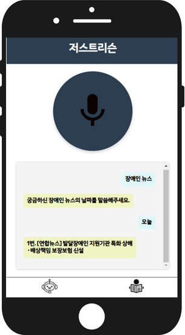
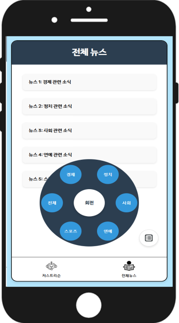

# 📌 프로젝트 개요
**프로젝트명**: **저스트리슨 (Just Listen)**  
**설명**: 시각장애인을 위한 **아이트래킹 기반 뉴스 요약 및 맞춤형 추천 음성 서비스** 

**공모전 성과**: [**뉴스빅데이터 공모전 본선 진출**](https://www.newsbigdata.kr/summary/summary.php)  
**비고**: 본 프로젝트는 아이디어 구현 단계로, 실제 아이트래킹 데이터를 수집·활용하는 과정에는 기술적 한계가 있었습니다. 
대신 데이터 기반 기획과 모델 설계를 통해 프로토타입을 제시했습니다.

---

  
  

# 🎯 프로젝트의 필요성과 서비스 도입 전후 비교

## **서비스 도입 이전의 문제점**
- **정보 접근성**: 기존 뉴스 서비스는 시각적 요소 위주로 제작되어 시각장애인이 효과적으로 접근하기 어려움.  
- **시간 소요**: 시각장애인은 **전체 뉴스 본문**을 청취해야 원하는 정보를 얻을 수 있음.  
- **비효율적 맞춤화**: 뉴스 음성화 서비스는 개인의 선호 주제나 관심사를 반영하지 않음.  

## **저스트리슨 도입 이후의 변화**
| **기존 서비스**            | **저스트리슨**                                |  
|----------------------------|---------------------------------------------|  
| **뉴스 전체 청취**          | **핵심 정보만 요약 제공** (아이트래킹 기반)        |  
| 비효율적 뉴스 탐색          | 개인 맞춤형 **AI 뉴스 추천** 제공              |  
| 시각적 UI로 접근성 한계     | **음성 명령 기반 UI**로 직관적 접근 가능         |  
| 뉴스 정보 습득 시간 30분+    | **청취 시간 10분 이내**로 단축                  |  

---

# 🧩 핵심 기능
1. **뉴스 요약 서비스**  
   - **아이트래킹 패턴 분석**: 중요도가 높은 부분만 요약  
   - 뉴스 접근 시간 **30% 단축**  

2. **맞춤형 뉴스 추천**  
   - 관심 키워드 기반 **개인화 뉴스 큐레이션**  
   - AI를 통한 **주제 필터링 및 추천**  

3. **음성 명령 기반 UX**  
   - **음성 인터페이스**로 키워드 입력 및 빠른 응답  
   - 비주얼 요소 없이 직관적 접근 가능  

4. **빅데이터 활용**  
   - **BigKinds 데이터셋** (100+ 언론사)  
   - 실시간 업데이트된 **최신 뉴스** 반영  

---

# 🚀 공모전 본선 진출 배경
- **창의적인 아이디어**: 아이트래킹 데이터를 활용한 시각 정보 패턴화  
- **기술력**: KoBERT 모델과 자연어처리(NLP)를 결합한 고도화된 뉴스 요약  
- **사회적 가치**: 시각장애인의 뉴스 접근성 향상을 통해 **정보 격차 해소**  

**결과**: 뉴스빅데이터 공모전에서 기술력과 실효성을 인정받아 **본선 진출**.  

---

# 🛠️ 기술 스택 및 아키텍처

## **기술 스택**  
- **프로그래밍 언어**: Python  
- **자연어 처리(NLP)**: KoNLPy, KoBERT  
- **AI 모델**: LLM (Large Language Model)  
- **음성 처리**: Google Web Speech API  
- **데이터**: BigKinds 뉴스 데이터셋  

---

# 📈 기대 효과

| **효과**                 | **세부 내용**                                      |  
|--------------------------|-------------------------------------------------|  
| **정보 접근성 개선**      | 시각장애인이 핵심 뉴스를 빠르고 쉽게 청취 가능         |  
| **시간 절감**             | 기존 뉴스 청취 시간의 **70% 절감**                  |  
| **맞춤형 뉴스 제공**       | AI 기반 관심사 필터링 및 맞춤형 큐레이션 제공         |  
| **사회적 가치 창출**       | 디지털 취약 계층의 **정보화 수준 향상** 및 삶의 질 개선 |  

---

# 🧑‍💻 팀 구성  
- **김나혜**: 프로젝트 기획 및 PM  
- **전정훈**: 데이터 처리 및 모델링  
- **이종민**: 음성 서비스 구현  
- **신충용**: UX/UI 설계 및 프론트엔드  

---

# 📧 연락처  
- **이메일**: vicky729.dev@gmail.com 
